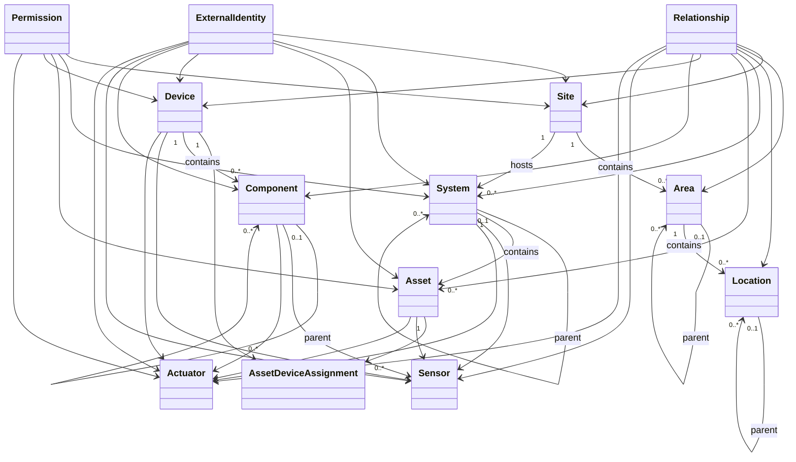

# 02 — Domain and CMDB Model

**Project:** GUARDIAN xMS  
**Document type:** Domain architecture  
**Status:** Draft  
**Version:** 0.2

---

## 1. Purpose

This document defines the core domain model and the logical structure of the GUARDIAN xMS Configuration Management Database (CMDB).

The model provides a stable foundation for:

- inventory,
- topology,
- device lifecycle,
- historical assignments,
- monitoring,
- event correlation,
- health calculation,
- impact analysis,
- automation,
- future multi-site operation.

The model is intentionally vendor-neutral and independent of a specific database technology.

---

## 2. Domain Overview

GUARDIAN xMS separates:

- organizational and spatial structure,
- functional systems,
- persistent operational roles,
- physical hardware,
- internal components,
- sensors and actuators,
- external identifiers,
- historical assignments,
- relationships,
- permissions.

The central distinction is:

> An Asset represents a persistent functional role.  
> A Device represents a concrete physical item.

This separation allows hardware to be replaced without losing the history of the functional role.

---

## 3. Core Hierarchy

The primary structural hierarchy is:

```text
Site
├── Area
│   └── Location
└── System
    └── Asset
        └── Device
            └── Component
                ├── Sensor
                └── Actuator
```

This hierarchy is complemented by historized relationship objects.

---

## 4. Core Entities

## 4.1 Site

A Site represents the highest-level managed physical or organizational environment.

Examples:

- residential property,
- factory,
- campus,
- data centre,
- branch office,
- remote technical installation.

Typical attributes:

```text
site_id
gid
name
description
status
timezone
address
geo_reference
created_at
updated_at
archived_at
```

A Site may contain Areas and Systems.

---

## 4.2 Area

An Area represents a larger spatial subdivision within a Site.

Examples:

- main building,
- basement,
- garden,
- production hall,
- technical building,
- parking area.

Typical attributes:

```text
area_id
gid
site_id
parent_area_id
name
description
status
created_at
updated_at
archived_at
```

Areas may be nested.

---

## 4.3 Location

A Location represents a specific installation or operating position.

Examples:

- battery rack,
- wall cabinet,
- utility room,
- switchboard field,
- roof section,
- server rack position.

Typical attributes:

```text
location_id
gid
area_id
parent_location_id
name
description
location_type
status
coordinates
created_at
updated_at
archived_at
```

Locations may be nested and may contain installed Assets or Devices through relationships.

---

## 4.4 System

A System represents a functional technical context.

Examples:

- energy storage system,
- photovoltaic system,
- heating system,
- network infrastructure,
- security system,
- pool system.

Typical attributes:

```text
system_id
gid
site_id
parent_system_id
system_type_id
name
description
status
criticality
created_at
updated_at
archived_at
```

Systems may contain subordinate Systems and Assets.

---

## 4.5 Asset

An Asset represents a persistent functional role in a technical system.

Examples:

- battery module position 5,
- primary inverter,
- grid meter,
- circulation pump,
- pool drive motor,
- rack switch.

Typical attributes:

```text
asset_id
gid
system_id
asset_type_id
name
description
status
criticality
lifecycle_state
commissioned_at
decommissioned_at
created_at
updated_at
archived_at
```

An Asset:

- is not tied permanently to one physical device,
- retains operational history across replacements,
- may exist temporarily without an assigned Device,
- may have one active Device assignment unless the AssetType permits multiple assignments.

---

## 4.6 Device

A Device represents a concrete physical item.

Examples:

- a specific Pylontech US2000C module,
- a specific Home Assistant Green,
- a specific inverter,
- a specific Sonoff actuator,
- a specific temperature sensor.

Typical attributes:

```text
device_id
gid
device_type_id
manufacturer
model
serial_number
hardware_revision
firmware_version
status
lifecycle_state
manufactured_at
purchased_at
installed_at
removed_at
created_at
updated_at
archived_at
```

A Device:

- has its own lifecycle,
- may be moved between Assets,
- may be stored, installed, defective, repaired or retired,
- retains its own measurements, events and maintenance history,
- must not use the manufacturer serial number as its primary identity.

---

## 4.7 Component

A Component represents a relevant internal or subordinate part of a Device.

Examples:

- battery cell,
- BMS board,
- communication interface,
- motor,
- fuse,
- fan,
- relay channel.

Typical attributes:

```text
component_id
gid
device_id
parent_component_id
component_type_id
name
position
status
replaceable
created_at
updated_at
archived_at
```

Components may be nested.

---

## 4.8 Sensor

A Sensor represents a source of measured or derived information.

Examples:

- cell voltage,
- battery current,
- state of charge,
- temperature,
- communication status,
- calculated health contribution.

Typical attributes:

```text
sensor_id
gid
owner_type
owner_id
sensor_type_id
name
unit
canonical_metric
status
sampling_interval
created_at
updated_at
archived_at
```

The owner may be a System, Asset, Device or Component.

---

## 4.9 Actuator

An Actuator represents a controllable function.

Examples:

- relay,
- breaker command,
- inverter mode selection,
- charge enable,
- load disconnect,
- remote shutdown.

Typical attributes:

```text
actuator_id
gid
owner_type
owner_id
actuator_type_id
name
status
safety_class
requires_approval
created_at
updated_at
archived_at
```

An Actuator command must be evaluated by the security and automation rules before execution.

---

## 5. Asset and Device Separation

## 5.1 Rationale

A physical device may fail, be replaced, repaired, stored or moved.

The functional role often remains unchanged.

Example:

```text
Asset:
Battery module position 5

Assigned Device until 2026-08-12:
Pylontech US2000C, serial number ABC123

Assigned Device from 2026-08-12:
Pylontech US2000C, serial number XYZ987
```

The Asset keeps:

- functional role,
- position,
- system context,
- criticality,
- long-term health history,
- incident context.

The Device keeps:

- serial number,
- firmware,
- physical history,
- repairs,
- failures,
- measurements recorded while assigned.

---

## 5.2 Assignment Entity

The assignment between Asset and Device is represented by a historized entity.

### AssetDeviceAssignment

```text
assignment_id
gid
asset_id
device_id
valid_from
valid_until
status
assignment_reason
installed_by
removed_by
provenance
created_at
updated_at
```

Rules:

1. The time interval is half-open:

```text
[valid_from, valid_until)
```

2. `valid_until = null` means the assignment is currently active.

3. Assignments are not overwritten.

4. Overlapping assignments are forbidden unless explicitly allowed by the AssetType.

5. A Device may not be actively assigned to incompatible Assets at the same time.

---

## 6. External Identity

External systems use their own identifiers.

Examples:

- Home Assistant entity ID,
- MQTT topic,
- Modbus address,
- serial number,
- MAC address,
- API object ID,
- vendor-specific device number.

These identifiers are stored separately from the Guardian ID.

### ExternalIdentity

```text
external_identity_id
gid
owner_type
owner_id
namespace
external_id
valid_from
valid_until
status
is_primary
confidence
provenance
created_at
updated_at
```

Examples:

```text
namespace: home_assistant.entity_id
external_id: sensor.guardian_battery_5_min_cell_voltage
```

```text
namespace: pylontech.serial_number
external_id: H221005E22212581
```

Rules:

- external identifiers may change,
- external identifiers may be historized,
- one object may have multiple external identities,
- uniqueness is enforced within the relevant namespace and validity interval,
- the Guardian ID remains stable.

---

## 7. Guardian ID

Each relevant domain object receives a stable Guardian ID.

Examples:

```text
SITE-000001
AREA-000004
LOC-000018
SYS-000012
AST-000034
DEV-001248
CMP-000452
SNS-003145
ACT-000087
ASN-000231
EXT-000942
REL-000761
```

Guardian IDs are:

- immutable,
- independent of external systems,
- never reused,
- suitable for references, APIs, logs and audit trails,
- not derived from names, serial numbers or locations.

---

## 8. Lifecycle

Every major entity supports lifecycle management.

Recommended lifecycle states include:

```text
planned
ordered
received
stored
installed
commissioning
active
degraded
maintenance
faulty
removed
retired
archived
```

Not every entity type must support every state.

Lifecycle transitions should be validated by type-specific rules.

---

## 9. Status and Lifecycle Are Different

`status` describes the current operational condition.

Examples:

```text
online
offline
warning
alarm
unknown
disabled
```

`lifecycle_state` describes the administrative or technical phase.

Examples:

```text
stored
installed
active
maintenance
retired
```

A Device may therefore be:

```text
lifecycle_state = active
status = alarm
```

or:

```text
lifecycle_state = stored
status = offline
```

---

## 10. Historization

GUARDIAN xMS preserves relevant history.

Historized objects include:

- AssetDeviceAssignment,
- ExternalIdentity,
- Relationship,
- Permission,
- relevant configuration values,
- lifecycle transitions,
- type migrations,
- ownership and location changes.

General rule:

> Relevant historical facts are ended by validity time, not overwritten.

---

## 11. Permissions

Permissions may be assigned to:

- User,
- Role,
- Service account,
- temporary service identity.

### Permission

```text
permission_id
gid
subject_type
subject_id
scope_type
scope_id
action
effect
valid_from
valid_until
status
granted_by
reason
created_at
updated_at
```

Rules:

- permissions are time-bounded by design,
- `valid_until = null` represents deliberate unlimited validity,
- temporary service and guest permissions should always expire,
- permissions affecting actuator control require auditability,
- revocation ends validity and does not remove history.

---

## 12. Logical Relationships

The hierarchy does not represent all real-world dependencies.

Additional relationships are modeled separately.

Examples:

```text
contains
located_at
installed_in
assigned_to
occupies_position
supplies
feeds_into
connected_to_bus
communicates_with
reports_to
controlled_by
depends_on
controls
monitors
measures
redundant_with
backs_up
protected_by
isolated_by
impacts
```

Relationships are specified in detail in the dedicated relationship model.

---

## 13. Cardinality Rules

### Site

```text
Site 1 ── 0..n Area
Site 1 ── 0..n System
```

### Area and Location

```text
Area 1 ── 0..n Location
Area 0..1 ── 0..n child Area
Location 0..1 ── 0..n child Location
```

### System and Asset

```text
System 1 ── 0..n Asset
System 0..1 ── 0..n child System
```

### Asset and Device

```text
Asset 1 ── 0..n AssetDeviceAssignment
Device 1 ── 0..n AssetDeviceAssignment
```

Normally:

```text
Asset 1 ── 0..1 active Device
Device 1 ── 0..1 active Asset
```

Exceptions must be declared by the corresponding type definition.

### Device and Component

```text
Device 1 ── 0..n Component
Component 0..1 ── 0..n child Component
```

### Sensor and Actuator

```text
System | Asset | Device | Component
    ├── 0..n Sensor
    └── 0..n Actuator
```

---

## 14. Domain Diagram



---

## 15. Example: Pylontech Battery Stack

### Site

```text
SITE-000001
Residential Property
```

### Area

```text
AREA-000001
Basement
```

### Location

```text
LOC-000001
Hycube Rack
```

### System

```text
SYS-000001
Residential Energy System
```

### Subsystem

```text
SYS-000002
Battery Storage System
```

### Asset

```text
AST-000005
Battery Module Position 5
```

### Device

```text
DEV-000105
Pylontech US2000C
serial_number = ...
```

### Assignment

```text
ASN-000048
asset_id = AST-000005
device_id = DEV-000105
valid_from = 2022-10-05T00:00:00+02:00
valid_until = null
status = active
```

### Components

```text
CMP-000501  Cell 1
CMP-000502  Cell 2
...
CMP-000515  Cell 15
CMP-000520  Battery Management System
```

### Sensors

```text
SNS-000901  Module voltage
SNS-000902  Module current
SNS-000903  State of charge
SNS-000904  Minimum cell voltage
SNS-000905  Maximum cell voltage
SNS-000906  Cell spread
SNS-000907  Temperature
SNS-000908  Communication status
```

The functional Asset remains stable when the physical battery module is replaced.

---

## 16. Validation Rules

1. Every domain object has exactly one immutable Guardian ID.

2. An archived parent object may not receive new active child assignments without explicit reactivation.

3. A Device serial number is not sufficient as the internal primary identity.

4. Active AssetDeviceAssignments must satisfy type compatibility.

5. Assignment validity intervals must not overlap when exclusivity applies.

6. External identities must be unique within namespace and validity interval where required.

7. Parent-child hierarchies must be acyclic.

8. Lifecycle transitions must comply with the relevant type definition.

9. Physical deletion of productive history is forbidden except under explicit retention or privacy rules.

10. Actuators with elevated safety classification require additional permission and audit controls.

---

## 17. Consequences for Implementation

The implementation must provide:

- immutable Guardian IDs,
- repositories for all core entities,
- temporal validity handling,
- lifecycle transition validation,
- assignment conflict detection,
- external identity resolution,
- hierarchical queries,
- relationship graph access,
- audit trails,
- migration support,
- replayable history.

The logical model remains independent of a specific persistence technology.

---

## 18. Related ADRs

The following architecture decisions are required:

- ADR-001 — Separate Asset and Device
- ADR-002 — Stable Guardian ID
- ADR-003 — Versioned Type Definitions and TypePackages
- ADR-004 — Relationships as First-Class CMDB Objects

These ADRs are maintained separately in `docs/architecture/ADR/`.

---

## 19. Open Questions

- Which entities require tenant ownership from the first implementation?
- Should Sensor and Actuator be independent tables or specialized Components?
- Which fields belong in the core schema and which belong in custom attributes?
- Which lifecycle states are global and which are type-specific?
- Which graph operations must be supported directly by the first persistence layer?
- Which historical records require immutable append-only storage?
