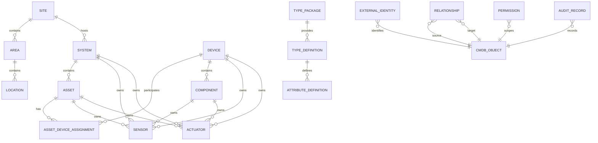

# 03 — Logical CMDB Data Model

**Project:** GUARDIAN xMS  
**Document type:** Logical data architecture  
**Status:** Draft  
**Version:** 0.3

---

## 1. Purpose

This document translates the GUARDIAN xMS domain and CMDB model into a logical, implementation-oriented data model.

The model defines:

- core entities,
- identifiers,
- temporal validity,
- ownership,
- references,
- uniqueness rules,
- archival behaviour,
- audit fields,
- extensibility points,
- logical constraints.

The model remains independent of a specific database engine.

---

## 2. General Modelling Rules

### 2.1 Stable Internal Identity

Every persisted domain object has:

```text
id
gid
```

`id` is the technical primary key used internally by the persistence layer.

`gid` is the immutable Guardian ID used across APIs, logs, exports, references and integrations.

### 2.2 No Business Meaning in Primary Keys

Technical IDs must not encode:

- location,
- hierarchy,
- serial number,
- manufacturer,
- lifecycle state,
- tenant,
- sequence position.

### 2.3 Soft Deletion and Archival

Productive objects are not physically deleted by default.

The standard pattern is:

```text
archived_at
archived_by
archive_reason
```

### 2.4 Auditability

Core records contain:

```text
created_at
created_by
updated_at
updated_by
record_version
```

### 2.5 Optimistic Concurrency

`record_version` is incremented on each update.

Conflicting updates must fail rather than silently overwrite newer data.

### 2.6 Temporal Validity

Historized records use:

```text
valid_from
valid_until
```

The interval is half-open:

```text
[valid_from, valid_until)
```

`valid_until = null` means currently valid.

---

## 3. Common Base Fields

Most CMDB entities use the following logical base structure:

```text
id                  technical primary key
gid                 immutable Guardian ID
name                human-readable name
description         optional description
status              current operational status
created_at          creation timestamp
created_by          actor or service
updated_at          last update timestamp
updated_by          actor or service
record_version      optimistic-lock version
archived_at         archival timestamp
archived_by         actor or service
archive_reason      reason for archival
```

Not every entity requires every field.

---

## 4. Site

```text
Site
----
id
gid
name
description
status
timezone
address_line_1
address_line_2
postal_code
city
region
country_code
latitude
longitude
created_at
created_by
updated_at
updated_by
record_version
archived_at
archived_by
archive_reason
```

Constraints:

- `gid` is globally unique.
- `timezone` uses an IANA timezone identifier.
- `country_code` uses ISO 3166-1 alpha-2 where applicable.
- archived Sites cannot receive new active Systems or Areas.

---

## 5. Area

```text
Area
----
id
gid
site_id
parent_area_id
area_type_id
name
description
status
sort_order
created_at
created_by
updated_at
updated_by
record_version
archived_at
archived_by
archive_reason
```

Constraints:

- `site_id` is mandatory.
- `parent_area_id`, when present, must reference an Area of the same Site.
- parent chains must be acyclic.
- sibling names need not be globally unique.
- optional uniqueness may be enforced per parent and active validity.

---

## 6. Location

```text
Location
--------
id
gid
area_id
parent_location_id
location_type_id
name
description
status
position_code
coordinates_json
sort_order
created_at
created_by
updated_at
updated_by
record_version
archived_at
archived_by
archive_reason
```

Constraints:

- `area_id` is mandatory.
- parent Locations must belong to the same Area.
- hierarchy must be acyclic.
- `position_code` may be unique within a parent Location where required by type.

---

## 7. System

```text
System
------
id
gid
site_id
parent_system_id
system_type_id
name
description
status
criticality
lifecycle_state
commissioned_at
decommissioned_at
created_at
created_by
updated_at
updated_by
record_version
archived_at
archived_by
archive_reason
```

Constraints:

- `site_id` is mandatory.
- `system_type_id` is mandatory.
- parent Systems must belong to the same Site.
- hierarchy must be acyclic.
- decommissioned Systems may remain queryable and retain their history.

---

## 8. Asset

```text
Asset
-----
id
gid
system_id
asset_type_id
name
description
status
criticality
lifecycle_state
asset_role
commissioned_at
decommissioned_at
created_at
created_by
updated_at
updated_by
record_version
archived_at
archived_by
archive_reason
```

Constraints:

- `system_id` is mandatory.
- `asset_type_id` is mandatory.
- the Asset remains stable across Device replacement.
- archived Assets cannot receive new active Device assignments.
- active assignment cardinality is validated against the AssetType.

---

## 9. Device

```text
Device
------
id
gid
device_type_id
manufacturer_id
model
serial_number
hardware_revision
firmware_version
status
lifecycle_state
manufactured_at
purchased_at
received_at
installed_at
removed_at
retired_at
created_at
created_by
updated_at
updated_by
record_version
archived_at
archived_by
archive_reason
```

Constraints:

- `device_type_id` is mandatory.
- `serial_number` is not the primary key.
- manufacturer and serial number uniqueness is configurable by DeviceType.
- firmware changes are historized when relevant.
- Device lifecycle is independent of Asset lifecycle.

---

## 10. AssetDeviceAssignment

```text
AssetDeviceAssignment
---------------------
id
gid
asset_id
device_id
valid_from
valid_until
status
assignment_reason
installation_reference
installed_by
removed_by
provenance
confidence
created_at
created_by
updated_at
updated_by
record_version
```

Constraints:

- `asset_id` and `device_id` are mandatory.
- `valid_from` is mandatory.
- `valid_until` must be greater than `valid_from`.
- overlapping assignments are prohibited where exclusivity applies.
- type compatibility must be validated.
- ended assignments are not reopened; a new record is created.
- assignment history is immutable except for controlled correction workflows.

Logical uniqueness:

```text
(asset_id, device_id, valid_from)
```

---

## 11. Component

```text
Component
---------
id
gid
device_id
parent_component_id
component_type_id
name
position_code
status
lifecycle_state
replaceable
serial_number
created_at
created_by
updated_at
updated_by
record_version
archived_at
archived_by
archive_reason
```

Constraints:

- `device_id` is mandatory.
- parent Components must belong to the same Device.
- hierarchy must be acyclic.
- position uniqueness is defined by ComponentType.
- independently replaceable Components may receive their own external identities and maintenance history.

---

## 12. Sensor

```text
Sensor
------
id
gid
owner_type
owner_id
sensor_type_id
name
description
status
canonical_metric_id
native_unit
canonical_unit
sampling_interval_seconds
data_quality_policy_id
created_at
created_by
updated_at
updated_by
record_version
archived_at
archived_by
archive_reason
```

Valid `owner_type` values:

```text
system
asset
device
component
```

Constraints:

- exactly one valid owner is required.
- `sensor_type_id` is mandatory.
- `canonical_metric_id` defines the normalized meaning.
- unit conversion must be deterministic.
- derived Sensors must reference their source through relationships or derivation definitions.

---

## 13. Actuator

```text
Actuator
--------
id
gid
owner_type
owner_id
actuator_type_id
name
description
status
safety_class
requires_approval
command_timeout_seconds
created_at
created_by
updated_at
updated_by
record_version
archived_at
archived_by
archive_reason
```

Constraints:

- exactly one valid owner is required.
- `actuator_type_id` is mandatory.
- commands must be checked against permissions, safety rules and interlocks.
- critical actuator operations require audit records.
- command support is derived from the associated ActuatorType.

---

## 14. ExternalIdentity

```text
ExternalIdentity
----------------
id
gid
owner_type
owner_id
namespace
external_id
valid_from
valid_until
status
is_primary
confidence
provenance
metadata_json
created_at
created_by
updated_at
updated_by
record_version
```

Constraints:

- `namespace` and `external_id` are mandatory.
- uniqueness is evaluated within namespace and temporal validity.
- one owner may have multiple external identities.
- one namespace may define at most one active primary identity per owner.
- invalidated identities remain historized.

Example namespaces:

```text
home_assistant.entity_id
mqtt.topic
pylontech.serial_number
modbus.unit_address
network.mac_address
vendor.device_id
```

---

## 15. Relationship

```text
Relationship
------------
id
gid
relationship_type_id
source_type
source_id
target_type
target_id
direction
status
criticality
confidence
provenance
valid_from
valid_until
attributes_json
created_at
created_by
updated_at
updated_by
record_version
archived_at
archived_by
archive_reason
```

Constraints:

- source and target must exist.
- source and target type compatibility is defined by RelationshipType.
- invalid self-references are rejected.
- hierarchical relationships must be acyclic.
- inverse views are computed unless explicitly persisted for performance.
- overlapping exclusive relationships are prohibited.
- discovered relationships require provenance and confidence.

---

## 16. Permission

```text
Permission
----------
id
gid
subject_type
subject_id
scope_type
scope_id
action
effect
valid_from
valid_until
status
granted_by
reason
constraints_json
created_at
created_by
updated_at
updated_by
record_version
```

Constraints:

- `effect` is `allow` or `deny`.
- deny rules take precedence where policy requires.
- temporary service permissions must have `valid_until`.
- control permissions are evaluated together with actuator safety rules.
- revoked Permissions retain their historical record.

---

## 17. Type References

The CMDB instance model references versioned type definitions.

Logical type entities include:

```text
SystemType
AssetType
DeviceType
ComponentType
SensorType
ActuatorType
RelationshipType
CapabilityType
MetricDefinition
StateDefinition
CommandDefinition
AttributeDefinition
ValidationRule
TypePackage
```

Instance records store a stable reference to the applicable type and type version.

A type upgrade must not silently reinterpret historical data.

---

## 18. Custom Attributes

Custom fields are supported through typed attribute definitions.

### AttributeDefinition

```text
id
gid
type_package_id
applies_to
key
display_name
data_type
unit
required
default_value
validation_rule_id
sensitive
searchable
version
status
```

### AttributeValue

```text
id
gid
owner_type
owner_id
attribute_definition_id
value_text
value_number
value_boolean
value_datetime
value_json
valid_from
valid_until
source
confidence
created_at
created_by
```

Rules:

- exactly one value column is populated according to `data_type`.
- sensitive values require access control.
- historical values use temporal validity.
- frequently queried core semantics must not be hidden in custom attributes.

---

## 19. Lifecycle History

Important lifecycle transitions are stored explicitly.

### LifecycleTransition

```text
id
gid
owner_type
owner_id
from_state
to_state
transitioned_at
transitioned_by
reason
source
metadata_json
created_at
```

Rules:

- transitions are append-only.
- invalid transitions are rejected.
- correction requires a separate correction record or controlled administrative workflow.

---

## 20. Audit Log

Security-relevant and configuration-changing operations generate audit records.

### AuditRecord

```text
id
gid
occurred_at
actor_type
actor_id
action
object_type
object_id
result
correlation_id
request_id
before_json
after_json
reason
source
```

Audit requirements include:

- permission changes,
- actuator commands,
- Device assignment changes,
- lifecycle changes,
- relationship changes,
- archival,
- type migration,
- security-policy changes.

---

## 21. Data Ownership and Tenant Readiness

The first implementation may operate as a single-tenant installation.

The logical model should nevertheless allow later introduction of:

```text
tenant_id
```

without changing Guardian IDs.

Recommended approach:

- Site is the initial ownership boundary.
- tenant ownership is added at selected aggregate roots.
- child ownership is derived where safe.
- cross-tenant relationships are forbidden by default.
- permissions never grant implicit cross-tenant access.

---

## 22. Logical Indexes

Recommended logical indexes include:

```text
unique(gid)
index(status)
index(lifecycle_state)
index(archived_at)
index(valid_from, valid_until)
index(owner_type, owner_id)
index(namespace, external_id)
index(asset_id, valid_until)
index(device_id, valid_until)
index(source_type, source_id)
index(target_type, target_id)
index(relationship_type_id)
index(site_id)
index(system_id)
```

Actual indexes depend on the selected persistence technology and query profile.

---

## 23. Referential Integrity

Required references use restrictive deletion behaviour.

Examples:

- a DeviceType cannot be deleted while Devices reference it,
- an Asset cannot be deleted while assignment history exists,
- a Site cannot be deleted while Systems or Areas exist,
- a Relationship cannot reference archived objects unless the relationship itself is historical or explicitly permitted.

Archival is preferred over cascading deletion.

---

## 24. Transaction Boundaries

The following operations should be atomic:

### Device Replacement

```text
end current AssetDeviceAssignment
create new AssetDeviceAssignment
update Device lifecycle states
write audit records
```

### Relationship Change

```text
end previous relationship
create replacement relationship
validate graph constraints
write audit record
```

### Permission Grant

```text
validate scope
validate validity interval
create permission
write audit record
```

### Actuator Command Preparation

```text
resolve actuator
resolve permissions
evaluate safety rules
evaluate interlocks
create command record
create audit record
```

---

## 25. Query Requirements

The persistence layer must support:

- current topology,
- historical topology at a point in time,
- current Asset-to-Device assignment,
- Device assignment history,
- object lookup by Guardian ID,
- object lookup by external identity,
- descendants and ancestors,
- impact traversal,
- dependency traversal,
- current permissions,
- historical permissions,
- active and archived objects,
- type and version resolution,
- audit retrieval,
- timeline reconstruction.

---

## 26. Example: Device Replacement

Initial state:

```text
Asset AST-000005
Device DEV-000105
Assignment ASN-000048
valid_from = 2022-10-05
valid_until = null
```

Replacement on 2026-08-12:

```text
ASN-000048.valid_until = 2026-08-12T10:30:00+02:00
ASN-000048.status = ended

new Device DEV-000212

new Assignment ASN-000091
asset_id = AST-000005
device_id = DEV-000212
valid_from = 2026-08-12T10:30:00+02:00
valid_until = null
status = active
```

The Asset identity and long-term functional history remain unchanged.

---

## 27. Mermaid Entity Overview



`CMDB_OBJECT` and `TYPE_DEFINITION` are logical abstractions in this diagram and do not require single physical tables.

---

## 28. Implementation Neutrality

This model can be implemented using:

- relational persistence,
- document persistence,
- graph persistence,
- hybrid persistence,
- event sourcing for selected aggregates.

The first implementation should favour operational simplicity while preserving:

- referential integrity,
- temporal querying,
- migration support,
- explainability,
- testability,
- local deployment.

---

## 29. Acceptance Criteria

The logical model is acceptable when it can represent:

1. a multi-site structure,
2. nested Areas and Locations,
3. nested Systems,
4. stable Assets,
5. replaceable physical Devices,
6. internal Components,
7. Sensors and Actuators,
8. multiple external identifiers,
9. historical assignments,
10. historical relationships,
11. time-bounded permissions,
12. audit records,
13. versioned type references,
14. custom attributes,
15. current and historical topology queries.

---

## 30. Open Decisions

The following choices require later ADRs:

- relational database technology,
- graph-query implementation,
- time-series storage,
- event-store boundaries,
- polymorphic ownership implementation,
- JSON-field usage,
- tenant strategy,
- audit retention,
- archival and privacy deletion policy,
- identifier generation format,
- schema migration tooling.
